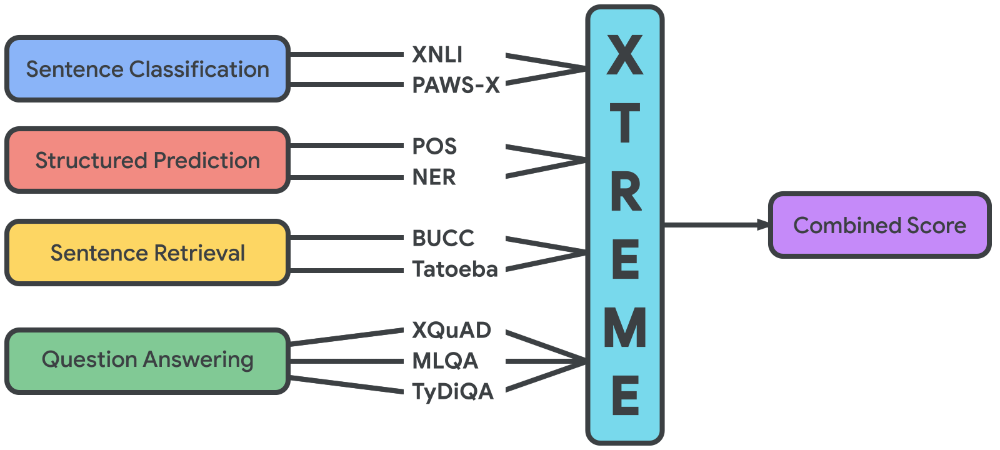

# XTREME: A Massively Multilingual Multi-task Benchmark for Evaluating Cross-lingual Generalization

[**Tasks**](#tasks-and-languages) | [**Download**](#download-the-data) |
[**Baselines**](#build-a-baseline-system) |
[**Leaderboard**](#leaderboard-submission) |
[**Website**](https://sites.research.google/xtreme) |
[**Paper**](https://arxiv.org/pdf/2003.11080.pdf) |
[**Translations**](https://console.cloud.google.com/storage/browser/xtreme_translations)

This repository contains information about XTREME, code for downloading data, and
implementations of baseline systems for the benchmark.

# Introduction

The Cross-lingual TRansfer Evaluation of Multilingual Encoders (XTREME) benchmark is a benchmark for the evaluation of the cross-lingual generalization ability of pre-trained multilingual models. It covers 40 typologically diverse languages (spanning 12 language families) and includes nine tasks that collectively require reasoning about different levels of syntax and semantics. The languages in XTREME are selected to maximize language diversity, coverage in existing tasks, and availability of training data. Among these are many under-studied languages, such as the Dravidian languages Tamil (spoken in southern India, Sri Lanka, and Singapore), Telugu and Malayalam (spoken mainly in southern India), and the Niger-Congo languages Swahili and Yoruba, spoken in Africa.

For a full description of the benchmark, see [the paper](https://arxiv.org/abs/2003.11080).

# Tasks and Languages

The tasks included in XTREME cover a range of standard paradigms in natural language processing, including sentence classification, structured prediction, sentence retrieval and question answering. The full list of tasks can be seen in the image below.



In order for models to be successful on the XTREME benchmark, they must learn representations that generalize across many tasks and languages. Each of the tasks covers a subset of the 40 languages included in XTREME (shown here with their ISO 639-1 codes): af, ar, bg, bn, de, el, en, es, et, eu, fa, fi, fr, he, hi, hu, id, it, ja, jv, ka, kk, ko, ml, mr, ms, my, nl, pt, ru, sw, ta, te, th, tl, tr, ur, vi, yo, and zh. The languages were selected among the top 100 languages with the [most Wikipedia articles](https://meta.wikimedia.org/wiki/List_of_Wikipedias) to maximize language diversity, task coverage, and availability of training data. They include members of the Afro-Asiatic, Austro-Asiatic, Austronesian, Dravidian, Indo-European, Japonic, Kartvelian, Kra-Dai, Niger-Congo, Sino-Tibetan, Turkic, and Uralic language families as well as of two isolates, Basque and Korean.

# Download the data

In order to run experiments on XTREME, the first step is to download the dependencies. We assume you have installed [`anaconda`](https://www.anaconda.com/) and use Python 3.7+. The additional requirements including `transformers`, `seqeval` (for sequence labelling evaluation), `tensorboardx`, `jieba`, `kytea`, and `pythainlp` (for text segmentation in Chinese, Japanese, and Thai), and `sacremoses` can be installed by running the following script:
```
bash install_tools.sh
```

The next step is to download the data. To this end, first create a `download` folder with ```mkdir -p download``` in the root of this project. You then need to manually download `panx_dataset` (for NER) from [here](https://www.amazon.com/clouddrive/share/d3KGCRCIYwhKJF0H3eWA26hjg2ZCRhjpEQtDL70FSBN) (note that it will download as `AmazonPhotos.zip`) to the `download` directory. Finally, run the following command to download the remaining datasets:
```
bash scripts/download_data.sh
```

Note that in order to prevent accidental evaluation on the test sets while running experiments,
we remove labels of the test data during pre-processing and change the order of the test sentences
for cross-lingual sentence retrieval.

# Build a baseline system

The evaluation setting in XTREME is zero-shot cross-lingual transfer from English. We fine-tune models that were pre-trained on multilingual data on the labelled data of each XTREME task in English. Each fine-tuned model is then applied to the test data of the same task in other languages to obtain predictions.

For every task, we provide a single script `scripts/train.sh` that fine-tunes pre-trained models implemented in the [Transformers](https://github.com/huggingface/transformers) repo. To fine-tune a different model, simply pass a different `MODEL` argument to the script with the corresponding model. The current supported models are `bert-base-multilingual-cased`, `xlm-mlm-100-1280` and `xlm-roberta-large`.

## Universal dependencies part-of-speech tagging

For part-of-speech tagging, we use data from the Universal Dependencies v2.5. You can fine-tune a pre-trained multilingual model on the English POS tagging data with the following command:
```
bash scripts/train.sh [MODEL] udpos
```

## Wikiann named entity recognition

For named entity recognition (NER), we use data from the Wikiann (panx) dataset. You can fine-tune a pre-trained multilingual model on the English NER data with the following command:
```
bash scripts/train.sh [MODEL] panx
```

## PAXS-X sentence classification

For sentence classification, we use the Cross-lingual Paraphrase Adversaries from Word Scrambling (PAWS-X) dataset. You can fine-tune a pre-trained multilingual model on the English PAWS data with the following command:
```
bash scripts/train.sh [MODEL] pawsx
```

## XNLI sentence classification

The second sentence classification dataset is the Cross-lingual Natural Language Inference (XNLI) dataset. You can fine-tune a pre-trained multilingual model on the English MNLI data with the following command:
```
bash scripts/train.sh [MODEL] xnli
```

## XQuAD, MLQA, TyDiQA-GoldP question answering

For question answering, we use the data from the XQuAD, MLQA, and TyDiQA-Gold Passage datasets.
For XQuAD and MLQA, the model should be trained on the English SQuAD training set. For TyDiQA-Gold Passage, the model is trained on the English TyDiQA-GoldP training set. Using the following command, you can first fine-tune a pre-trained multilingual model on the corresponding English training data, and then you can obtain predictions on the test data of all tasks.
```
bash scripts/train.sh [MODEL] [xquad,mlqa,tydiqa]
```

## BUCC sentence retrieval

For cross-lingual sentence retrieval, we use the data from the Building and Using Parallel Corpora (BUCC) shared task. As the models are not trained for this task but the representations of the pre-trained models are directly used to obtain similarity judgements, you can directly apply the model to obtain predictions on the test data of the task:
```
bash scripts/train.sh [MODEL] bucc2018
```

## Tatoeba sentence retrieval

The second cross-lingual sentence retrieval dataset we use is the Tatoeba dataset. Similarly to BUCC, you can directly apply the model to obtain predictions on the test data of the task:
```
bash scripts/train.sh [MODEL] tatoeba
```

# Leaderboard Submission

## Submissions
To submit your predicitons to [**XTREME**](https://sites.research.google/xtreme), please create one single folder that contains 9 sub-folders named after all the tasks, i.e., `udpos`, `panx`, `xnli`, `pawsx`, `xquad`, `mlqa`, `tydiqa`, `bucc2018`, `tatoeba`. Inside each sub-folder, create a file containing the predicted labels of the test set for all languages. Name the file using the format `test-{language}.{extension}` where `language` indicates the 2-character language code, and `extension` is `json` for QA tasks and `tsv` for other tasks. You can see an example of the folder structure in `mock_test_data/predictions`.

## Evaluation
We will compare your submissions with our label files using the following command:
```
python evaluate.py --prediction_folder [path] --label_folder [path]
```

# Translations

As part of training translate-train and translate-test baselines we have automatically translated
English training sets to other languages and tests sets to English. Translations are available for
the following datasets: SQuAD v1.1 (only train and dev), MLQA, PAWS-X, TyDiQA-GoldP, XNLI, and XQuAD.

For PAWS-X and XNLI, the translations are in the following format:
Column 1 and Column 2: original sentence pairs
Column 3 and Column 4: translated sentence pairs
Column 5: label

This will help make the association between the original data and their translations.

For XNLI and XQuAD, we have furthermore created pseudo test sets by automatically translating the English test set to the remaining
languages in XTREME so that test data for all 40 languages is available. Note that
these translations are noisy and should not be treated as ground truth.

All translations are available [here](https://console.cloud.google.com/storage/browser/xtreme_translations).

# Paper

If you use our benchmark or the code in this repo, please cite our paper `\cite{hu2020xtreme}`.
```
@article{hu2020xtreme,
      author    = {Junjie Hu and Sebastian Ruder and Aditya Siddhant and Graham Neubig and Orhan Firat and Melvin Johnson},
      title     = {XTREME: A Massively Multilingual Multi-task Benchmark for Evaluating Cross-lingual Generalization},
      journal   = {CoRR},
      volume    = {abs/2003.11080},
      year      = {2020},
      archivePrefix = {arXiv},
      eprint    = {2003.11080}
}
```
Please consider including a note similar to the one below to make sure to cite all the individual datasets in your paper.

We experiment on the XTREME benchmark `\cite{hu2020xtreme}`, a composite benchmark for multi-lingual learning consisting of data from the XNLI `\cite{Conneau2018xnli}`, PAWS-X `\cite{Yang2019paws-x}`, UD-POS `\cite{nivre2018universal}`, Wikiann NER `\cite{Pan2017}`, XQuAD `\cite{artetxe2020cross}`, MLQA `\cite{Lewis2020mlqa}`, TyDiQA-GoldP `\cite{Clark2020tydiqa}`, BUCC 2018 `\cite{zweigenbaum2018overview}`, Tatoeba `\cite{Artetxe2019massively}` tasks. We provide their BibTex information as follows.
```
@inproceedings{Conneau2018xnli,
    title = "{XNLI}: Evaluating Cross-lingual Sentence Representations",
    author = "Conneau, Alexis  and
      Rinott, Ruty  and
      Lample, Guillaume  and
      Williams, Adina  and
      Bowman, Samuel  and
      Schwenk, Holger  and
      Stoyanov, Veselin",
    booktitle = "Proceedings of EMNLP 2018",
    year = "2018",
    pages = "2475--2485",
}

@inproceedings{Yang2019paws-x,
    title = "{PAWS-X}: A Cross-lingual Adversarial Dataset for Paraphrase Identification",
    author = "Yang, Yinfei  and
      Zhang, Yuan  and
      Tar, Chris  and
      Baldridge, Jason",
    booktitle = "Proceedings of EMNLP 2019",
    year = "2019",
    pages = "3685--3690",
}

@article{nivre2018universal,
  title={Universal Dependencies 2.2},
  author={Nivre, Joakim and Abrams, Mitchell and Agi{\'c}, {\v{Z}}eljko and Ahrenberg, Lars and Antonsen, Lene and Aranzabe, Maria Jesus and Arutie, Gashaw and Asahara, Masayuki and Ateyah, Luma and Attia, Mohammed and others},
  year={2018}
}

@inproceedings{Pan2017,
author = {Pan, Xiaoman and Zhang, Boliang and May, Jonathan and Nothman, Joel and Knight, Kevin and Ji, Heng},
booktitle = {Proceedings of ACL 2017},
pages = {1946--1958},
title = {{Cross-lingual name tagging and linking for 282 languages}},
year = {2017}
}

@inproceedings{artetxe2020cross,
author = {Artetxe, Mikel and Ruder, Sebastian and Yogatama, Dani},
booktitle = {Proceedings of ACL 2020},
title = {{On the Cross-lingual Transferability of Monolingual Representations}},
year = {2020}
}

@inproceedings{Lewis2020mlqa,
author = {Lewis, Patrick and Oğuz, Barlas and Rinott, Ruty and Riedel, Sebastian and Schwenk, Holger},
booktitle = {Proceedings of ACL 2020},
title = {{MLQA: Evaluating Cross-lingual Extractive Question Answering}},
year = {2020}
}

@inproceedings{Clark2020tydiqa,
author = {Jonathan H. Clark and Eunsol Choi and Michael Collins and Dan Garrette and Tom Kwiatkowski and Vitaly Nikolaev and Jennimaria Palomaki},
booktitle = {Transactions of the Association of Computational Linguistics},
title = {{TyDi QA: A Benchmark for Information-Seeking Question Answering in Typologically Diverse Languages}},
year = {2020}
}

@inproceedings{zweigenbaum2018overview,
  title={Overview of the third BUCC shared task: Spotting parallel sentences in comparable corpora},
  author={Zweigenbaum, Pierre and Sharoff, Serge and Rapp, Reinhard},
  booktitle={Proceedings of 11th Workshop on Building and Using Comparable Corpora},
  pages={39--42},
  year={2018}
}

@article{Artetxe2019massively,
author = {Artetxe, Mikel and Schwenk, Holger},
journal = {Transactions of the ACL 2019},
title = {{Massively Multilingual Sentence Embeddings for Zero-Shot Cross-Lingual Transfer and Beyond}},
year = {2019}
}
```
